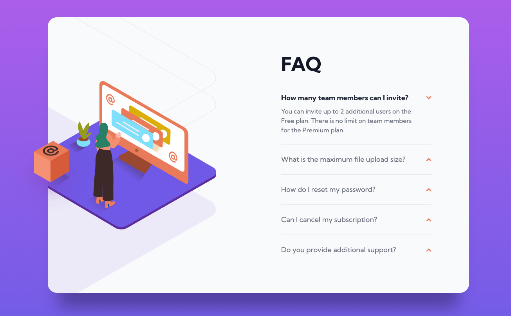

# Frontend Mentor - FAQ accordion card solution

This is a solution to the [FAQ accordion card challenge on Frontend Mentor](https://www.frontendmentor.io/challenges/faq-accordion-card-XlyjD0Oam). Frontend Mentor challenges help you improve your coding skills by building realistic projects. 

## Table of contents

- [Overview](#overview)
  - [The challenge](#the-challenge)
  - [Screenshot](#screenshot)
  - [Links](#links)
- [My process](#my-process)
  - [Built with](#built-with)
  - [What I learned](#what-i-learned)
- [Author](#author)

## Overview

### The challenge

Users should be able to:

- View the optimal layout for the component depending on their device's screen size
- See hover states for all interactive elements on the page
- Hide/Show the answer to a question when the question is clicked

### Screenshot

### Links

- Solution URL: [Add solution URL here](https://your-solution-url.com)
- Live Site URL: [https://rm-fm-faq-accordion-card.netlify.app](https://rm-fm-faq-accordion-card.netlify.app/)

## My process

### Built with

- Semantic HTML5 markup
- Flexbox
- Mobile-first workflow
- [Svelte](https://svelte.dev/) - JS library
- [Tailwindcss](https://tailwindcss.com/) - CSS framework

### What I learned

I used this challange as a way to get better with the Svelte framework. Added subtle bits of animation to practice with the utilities Svelte has to offer. Also setup events so only one answer could be opened at one time.

## Author

- Website - [Ryan Menner](https://ryanmenner.com)
- Frontend Mentor - [@rmenner](https://www.frontendmentor.io/profile/rmenner)
- Twitter - [@ryanmenner](https://twitter.com/ryanmenner)
